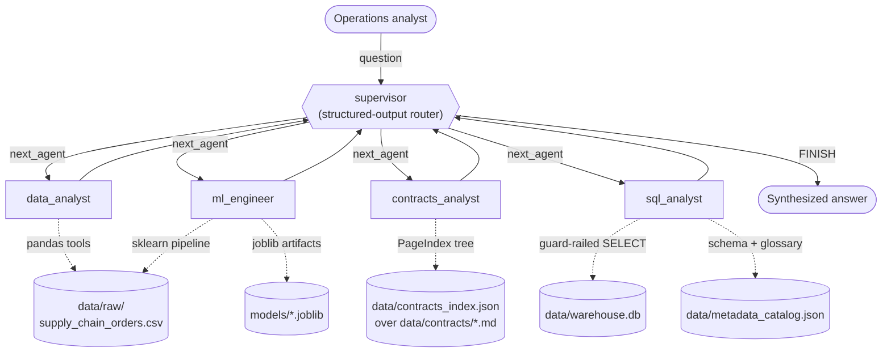
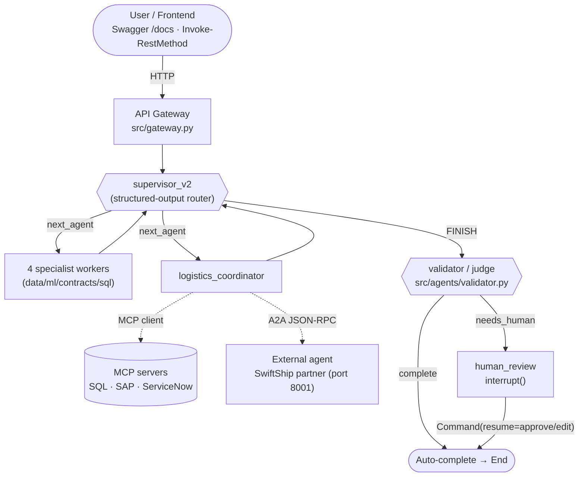

# Weeks 3 & 4 — LangGraph Multi-Agent Supply Chain Intelligence

> **Zero to Hero, Weeks 3 & 4** · Week 3: *The Agent Forge* · Week 4: *The Orchestrator's Citadel*

A logistics company is bleeding money on late shipments — customer penalties, churn,
firefighting. Over these two weeks you build the fix end to end: a **LangGraph
supervisor multi-agent system** that an operations analyst can simply *talk to*. One
coherent system, three hard skills welded together:

1. **Classical ML** — a leakage-proof, imbalance-aware late-delivery classifier (scikit-learn)
2. **Vectorless RAG** — PageIndex-style *reasoning* retrieval over carrier & supplier contracts (no vector DB)
3. **NL2SQL** — natural language to SQL over a warehouse, grounded in an OpenMetadata-style catalog

The payoff is the **flagship demo question** — one sentence that no single agent can
answer, because the facts live in three different systems (a model, a contract, a
database):

> *"Order 104872 ships Same Day via SwiftShip Express to Western Europe — how likely is
> it to be late, what penalty applies under the SwiftShip contract if it is, and what
> was SwiftShip's late rate last quarter?"*

The supervisor dispatches the **ml_engineer** (risk score), the **contracts_analyst**
(SwiftShip MSA: 2% of shipment value per late business day, capped at 15%), and the
**sql_analyst** (quarterly late rate from the warehouse) — then synthesizes one answer.
Run it yourself: `python main.py --demo`.

---

## Architecture at a glance

A supervisor node routes each request to one of four specialist workers (or several in
sequence), each worker reports back, and the supervisor decides the next hop or
`FINISH`. Every node reads and writes one shared state object
(`src/state.py: SupplyChainState`).



| Worker | Capability | Backing tech |
|---|---|---|
| `data_analyst` | EDA: late rate by mode/region/category, trends, class balance | pandas tools over the canonical CSV |
| `ml_engineer` | Train/evaluate/tune late-delivery classifiers, explain drivers, score orders | `src/ml_pipeline` (scikit-learn) |
| `contracts_analyst` | Penalties, SLAs, payment terms from procurement contracts | `src/pageindex` (vectorless reasoning RAG) |
| `sql_analyst` | NL → SQL over the warehouse, schema-grounded, self-repairing | SQLite + `src/metadata` catalog |

The full contract — every file path, function signature, and data schema — lives in
[ARCHITECTURE.md](ARCHITECTURE.md). The 10-day curriculum lives in
[TRAINING_PLAN.md](TRAINING_PLAN.md).

---

## Production layers (v2) — build the full architecture yourself

The core above is the *middle* of a production architecture. The repo also ships the
outer layers — an **API gateway**, **MCP servers** (mock SAP/ServiceNow + a SQL shim)
with a sync protocol client, an **external carrier agent** reached over **A2A**, a
**validator/judge** gate, and **human review** with interrupt/resume — plus
[BUILD_MANUAL.md](BUILD_MANUAL.md): a beginner-proof, chapter-per-box manual that
builds and runs every layer with checkpoints (works fully offline).



Start with [BUILD_MANUAL.md](BUILD_MANUAL.md) Chapter 0, or run the layers cell-by-cell
in `labs/lab10_production_layers.py`.

---

## When to reach for LangGraph (and when not to)

The first question a client will ask: *"do we actually need agents for this?"* Often the
answer is no — and saying so builds trust. Match the tool to the need:

| Need | Better Fit |
| --- | --- |
| Simple chatbot | LLM / LangChain |
| Knowledge Q&A | RAG |
| Multi-step workflow | LangGraph |
| Human approval | LangGraph |
| Long-running process | LangGraph |
| Multi-agent orchestration | LangGraph |
| Enterprise auditability | LangGraph + observability |

This project deliberately lives in the bottom rows: the flagship question is a
**multi-step, multi-agent workflow** (supervisor orchestration), the state is
**checkpointable** for long-running and human-approval flows (`MemorySaver` in
`main.py`, the HITL interrupt sketch in [CHALLENGES_GUIDE.md](CHALLENGES_GUIDE.md)),
and every hop is **auditable** in the streamed trace. The top rows are also in here —
as *components*: the contracts RAG and the plain LLM calls exist inside workers, which
is exactly the point — agentic systems contain RAG and LLM calls; they don't replace them.

---

## Quickstart

From the `week3&4` directory (**quote the path — it contains `&`**):

```powershell
cd "C:\...\zeroToHero_Training\week3&4"

# 1. Install (Python 3.11–3.14)
pip install -r requirements.txt

# 2. Generate the synthetic world (idempotent, seed=42)
python data\generate_supply_chain_data.py   # → data/raw/supply_chain_orders.csv (~12k orders)
python data\generate_contracts.py           # → data/contracts/*.md (6 contracts)
python data\build_database.py               # → data/warehouse.db + data/metadata_catalog.json
python data\render_contracts_pdf.py         # → data/contracts_pdf/*.pdf (optional — realistic PDF renditions of the contracts)

# 3. Configure an LLM — or don't (see Offline mode below)
copy .env.example .env       # then set LLM_PROVIDER + the matching API key
#   ...or skip keys entirely:  set OFFLINE=1

# 4. Verify, then run
python main.py --offline-check   # PASS/FAIL on every no-key fallback
python main.py --demo            # 5 scenarios incl. the flagship 3-agent question
python main.py --ask "Which carrier has the worst late rate, and what penalty does its contract specify?"
```

On macOS/Linux use forward slashes (`python data/generate_supply_chain_data.py`) and
`cp .env.example .env` / `export OFFLINE=1`.

---

## Offline mode — no API key? You still run most of this

Classrooms don't always have keys, so offline support is a first-class design goal
(ARCHITECTURE.md §5). `src/config.py: is_offline()` returns `True` when `OFFLINE=1` is
set **or** no provider key exists — and every module degrades deliberately:

| Capability | Without any API key |
|---|---|
| Data generators, warehouse, metadata catalog | **Fully works** (no LLM involved) |
| ML pipeline: EDA, training, threshold tuning, drivers — **labs 01–03** | **Fully works** |
| PageIndex tree build + lexical retrieval — **lab 06** | **Fully works** (heading summaries + keyword scoring instead of LLM navigation) |
| SQL guardrails + query tool | **Fully works** |
| Toy state-machine graph + tool inspection (parts of labs 04, 05, 07, 08, 09) | **Works** — every lab opens with a banner cell saying exactly which cells need a key |
| v2: MCP servers + protocol client, external A2A agent, heuristic validator, HITL interrupt/resume — **lab 10** | **Fully works** (no LLM involved — see BUILD_MANUAL.md) |
| v2: API gateway (`uvicorn src.gateway:app`) | **Works** — serves the keyword-routed demo graph, responses tagged `"mode": "offline-demo"` |
| ReAct workers, supervisor routing, `--demo` / `--ask` | Needs a key (the CLI prints clear setup instructions instead of failing) |
| Test suite (`python -m pytest tests/ -q`) | **Fully green** — routing tests mock the LLM |

So a key-less classroom completes labs 01–03 and 06 in full, plus the offline halves
of every other lab — and `python main.py --offline-check` proves it in one command.

---

## Repo tour

| Path | What it is |
|---|---|
| `ARCHITECTURE.md` | The binding contract: paths, signatures, schemas — single source of truth |
| `TRAINING_PLAN.md` | 10-day curriculum: concept blocks, labs, checkpoints, trials, capstone rubric |
| `CHALLENGES_GUIDE.md` | Production issues & challenges — the Week 1–2 whiteboarding companion: every challenge (loops, hallucinations, injection, drift, cost, governance, observability, eval, memory) demonstrated and mitigated in this repo |
| `main.py` | CLI front door: `--ask` / `--demo` / `--offline-check` |
| `requirements.txt` · `.env.example` | Dependencies · provider/env template |
| `data/` | Idempotent generators + their outputs (`raw/` CSV, `contracts/` markdown, `contracts_pdf/` realistic PDF renditions via `render_contracts_pdf.py`, `warehouse.db`, `metadata_catalog.json`) |
| `src/config.py` | `get_llm()` provider switch, `is_offline()`, `PROJECT_ROOT` |
| `src/state.py` | `SupplyChainState`, `WORKERS` — the shared graph state schema |
| `src/ml_pipeline/` | Loader (+ DataCo column map), EDA, features, preprocess, train, evaluate, explain |
| `src/pageindex/` | Vectorless RAG: markdown → tree index (`tree_builder.py`), reasoning/lexical retrieval (`retriever.py`) |
| `src/metadata/` | OpenMetadata-style catalog client (`catalog.py`) over the catalog JSON |
| `src/agents/` | `@tool` wrappers (`tools_ml/rag/sql/mcp/a2a.py`), ReAct workers, structured-output supervisors (v1 + v2), validator/judge |
| `src/graph.py` | `build_graph()` — wires supervisor + 4 workers into a compiled LangGraph app |
| `BUILD_MANUAL.md` | Step-by-step manual: build every box of the full architecture, beginner-proof, offline-capable |
| `src/mcp_servers/` | Mock SAP + ServiceNow MCP servers, SQL shim over the guard-railed tool, sync stdio client |
| `src/a2a/` | External "SwiftShip partner" agent service (A2A-style: agent card + JSON-RPC message/send) |
| `src/state_v2.py` · `src/graph_v2.py` | v2 state (+verdict) · v2 graph: 5 workers + validator + human-review interrupt/resume |
| `src/gateway.py` | FastAPI front door: `/ask`, `/resume`, `/threads/{id}/state`, `/health` (+ Swagger UI at `/docs`) |
| `labs/` | 10 teaching labs — plain `.py` with `# %%` cell markers (run cell-by-cell in VS Code) |
| `exercises/` | Week 3 & 4 trial starters, trainer-only solutions, quizzes |
| `models/` | Saved model artifacts (created at runtime by `train_model`) |
| `tests/` | Offline-safe pytest suite, including mocked-LLM graph routing |

---

## Swapping in the real Kaggle DataCo dataset

The synthetic CSV (~12k rows, seed 42) has the same schema and planted signal as the
real **DataCo Smart Supply Chain** dataset (~180k rows). To upgrade,
`src/ml_pipeline/data_loader.py` ships `DATACO_COLUMN_MAP`, which translates Kaggle
headers (e.g. `Days for shipment (scheduled)` → `scheduled_shipping_days`,
`Late_delivery_risk` → `late_delivery`). `load_orders()` applies the rename
automatically — point it at the downloaded file:

```python
from src.ml_pipeline.data_loader import load_orders
df = load_orders("path/to/DataCoSupplyChainDataset.csv", drop_leakage=True)
```

Everything downstream — EDA, training, the `ml_engineer` agent — runs unchanged.

---

## Switching LLM providers

One env var selects the provider; `src/config.py: get_llm()` does the rest:

```bash
LLM_PROVIDER=azure_openai   # default — matches the rest of the Zero-to-Hero curriculum
LLM_PROVIDER=openai
LLM_PROVIDER=anthropic
```

Set the matching credentials from `.env.example`
(`AZURE_OPENAI_API_KEY`/`AZURE_OPENAI_ENDPOINT`/`AZURE_OPENAI_DEPLOYMENT`,
`OPENAI_API_KEY`, or `ANTHROPIC_API_KEY`). No code changes anywhere — every agent calls
`get_llm()`.

---

## Running the tests

```powershell
cd "C:\...\zeroToHero_Training\week3&4"
python -m pytest tests/ -q
```

All tests pass **offline** — no API keys, no network. Data-dependent tests generate
what they need via the idempotent generators; the graph-routing test drives the real
compiled graph with a fake structured-output LLM (ARCHITECTURE.md §6).

---

## Where to next

- **Learning the system?** Start with [TRAINING_PLAN.md](TRAINING_PLAN.md), Day 1.
- **Building the full architecture (gateway, MCP, A2A, validator, human review)?** Follow [BUILD_MANUAL.md](BUILD_MANUAL.md) chapter by chapter — beginner-proof, offline-capable.
- **Building on the system?** [ARCHITECTURE.md](ARCHITECTURE.md) is the contract — read §4 before touching `src/`.
- **Demoing to a client?** `python main.py --demo`, then open `src/graph.py` and tell the story from the mermaid graph above.
- **Talking production risks?** [CHALLENGES_GUIDE.md](CHALLENGES_GUIDE.md) maps every whiteboarding-session challenge (agent loops, hallucinations, prompt/SQL injection, cost, drift, governance, observability, evaluation, memory) to where it lives in this repo and how to harden it.
